<!-- ========================================================= -->
<!-- CORECONNECT :: STUDENT RESOURCE INTERFACE -->
<!-- ========================================================= -->

<p align="center">

<svg width="110" height="110" viewBox="0 0 200 200">
  <defs>
    <linearGradient id="neon" x1="0%" y1="0%" x2="100%" y2="100%">
      <stop offset="0%" stop-color="#00F5FF"/>
      <stop offset="100%" stop-color="#ff00ff"/>
    </linearGradient>
  </defs>
  <circle cx="100" cy="100" r="86" fill="none" stroke="url(#neon)" stroke-width="6"/>
  <circle cx="100" cy="100" r="60" fill="none" stroke="#00F5FF" stroke-width="2"/>
  <text x="50%" y="54%" dominant-baseline="middle" text-anchor="middle"
        font-size="40" fill="#00F5FF" font-family="monospace">
        CC
  </text>
</svg>

</p>

<p align="center">
  
</p>

<p align="center">
  
</p>

<p align="center">
  
  
  
  
</p>

---

<p align="center">
  
</p>

# 🧠 CORECONNECT

Coreconnect is a **student-focused resource platform** designed to simplify how academic materials, announcements, and class updates are accessed and managed.

Many college communication channels — especially Telegram groups — become crowded and difficult to navigate. Important files, schedules, and links often get buried in endless message streams.

Coreconnect solves this by providing a **clean, structured, and visually intuitive interface** where students can quickly find what they actually need.

With Coreconnect, students can:

📚 Access lecture PDFs, PPTs, and study materials  
📢 Stay updated with class announcements  
📹 Jump directly to live sessions or recordings  
🧠 Track academic activities and resources  

The goal is simple:

> **Reduce chaos. Improve clarity. Save student time.**

---

<p align="center">
  
</p>

# 🚀 TECHNOLOGY STACK

Coreconnect is built using a modern, fast, and scalable web stack:

| Layer | Technology |
|------|-------------|
| **Frontend** | React + TypeScript |
| **Build System** | Vite |
| **Styling** | TailwindCSS |
| **Backend / DB** | Supabase |
| **Authentication** | Supabase Auth |

This architecture ensures:

✅ Fast performance  
✅ Realtime-friendly data flow  
✅ Clean component structure  
✅ Easy extensibility  

---

<p align="center">
  
</p>

# 🛸 PLATFORM DESIGN

## 👨‍🎓 Student View

Designed for everyday academic usage.

Students can:

• Browse organized study resources  
• View announcements without noise  
• Access class links instantly  
• Navigate materials with minimal friction  

---

## 🛠 Admin View

Designed for resource and content management.

Admins can:

• Upload and manage academic materials  
• Post important updates  
• Maintain resource links  
• Keep student feeds structured  

---

<p align="center">
  
</p>

# 🧬 DATA FLOW OVERVIEW

```mermaid
graph TD;
    Telegram[📢 Announcement Sources] -->|Sync| Coreconnect[🧠 Coreconnect Platform];
    Coreconnect -->|Display| Students[👨‍🎓 Students];
    Admins[🛠 Admin Panel] -->|Manage Resources| Coreconnect;
```



Coreconnect acts as a structured layer between noisy communication channels and student-friendly resource access.
---


<p align="center">
<i>Visual micro-interaction module • Hover-responsive neural grid</i>
</p>

---


---

<p align="center">
  
</p>

# ⚡ LIVE DEVELOPMENT ACTIVITY

<p align="center">
  
</p>

---

<p align="center">
  
</p>

# 🛠 LOCAL SETUP

```bash
git clone https://github.com/avadaKedavaaraa/coreconnect.git
cd coreconnect
npm install
npm run dev
```

---

# 🔐 ENVIRONMENT VARIABLES

```
VITE_SUPABASE_URL=your_url
VITE_SUPABASE_ANON_KEY=your_key
VITE_GEMINI_API_KEY=your_key
VITE_ADMIN_PASSWORD=optional
```

⚠ Never commit secrets publicly.

---

<p align="center">
  
</p>

# 📊 PROJECT STATS

<p align="center">
  
  
</p>

---

# 👁 VISITOR COUNT

<p align="center">
  
</p>

---

<p align="center">
  
</p>

<p align="center">
<b>CORECONNECT :: Built to Simplify Student Access 🚀</b>
</p>
