<!-- ========================================================= -->
<!-- CORECONNECT :: FINAL FORM • VISUAL DOMINANCE MODE -->
<!-- ========================================================= -->

<p align="center">

<!-- ===== FINAL FORM EMBLEM ===== -->

<svg width="140" height="140" viewBox="0 0 200 200">
  <defs>
    <linearGradient id="finalGlow" x1="0%" y1="0%" x2="100%" y2="100%">
      <stop offset="0%" stop-color="#00F5FF"/>
      <stop offset="100%" stop-color="#ff00ff"/>
    </linearGradient>
  </defs>

  <circle cx="100" cy="100" r="92" fill="none" stroke="url(#finalGlow)" stroke-width="4"/>
  <circle cx="100" cy="100" r="68" fill="none" stroke="#00F5FF" stroke-width="1.2"/>

  <text x="50%" y="54%" text-anchor="middle"
        font-size="32"
        fill="#00F5FF"
        font-family="monospace">
        CC
  </text>
</svg>

</p>

<p align="center">
  
</p>

<p align="center">
  
</p>

<p align="center">
  
  
  
  
</p>

---

```
CORECONNECT :: SYSTEM STATUS

Signal Noise: Eliminated
Resource Access: Optimized
Interface Stability: Confirmed
User Experience: Fluid
```

---

# 🧠 CORECONNECT

Coreconnect is a student-centric academic resource interface designed to impose **structure, clarity, and navigational simplicity** over inherently chaotic communication channels.

Modern academic ecosystems rely heavily on Telegram groups, fragmented links, and scattered document sharing. While convenient, these mediums rapidly degrade into dense information streams where critical materials become difficult to retrieve.

Coreconnect resolves this by introducing a **visually structured command layer**.

Announcements become observable.  
Resources become navigable.  
Interactions become predictable.

The platform prioritizes **clarity over clutter** and **flow over friction**.

---

<p align="center">
  
</p>

# 🚀 DESIGN PHILOSOPHY

Academic interfaces should minimize cognitive load.

Coreconnect enforces:

✔ Spatial visual hierarchy  
✔ Instant resource discovery  
✔ Reduced noise density  
✔ Predictable interaction patterns  

Every component exists to serve a singular objective:

> **Allow students to find what they need instantly.**

---

<p align="center">
  
</p>

# 🛰 PLATFORM CAPABILITIES

## 👨‍🎓 Student Interface

Students may:

• Browse structured academic resources  
• Observe announcements without clutter  
• Access class links instantly  
• Navigate materials frictionlessly  

---

## 🛠 Admin Interface

Administrators may:

• Upload & manage learning assets  
• Broadcast important updates  
• Maintain resource topology  
• Preserve information structure  

---

<p align="center">
  
</p>

# 🧬 DATA FLOW MODEL

```mermaid
graph TD;
    Sources[📢 Telegram Streams] --> Coreconnect[🧠 Coreconnect Interface];
    Coreconnect --> Students[👨‍🎓 Students];
    Admins[🛠 Admin Panel] --> Coreconnect;
```



Coreconnect acts as a stabilization layer between noisy communication channels and student-friendly resource access.

---

<p align="center">
  
</p>

# ⚡ LIVE DEVELOPMENT SIGNALS

<p align="center">
  
</p>

---

<p align="center">
  
</p>

# 🛰 SYSTEM TELEMETRY :: FINAL FORM

<p align="center">


</p>

---

# 🛠 LOCAL SETUP PROTOCOL

```bash
git clone https://github.com/avadaKedavaaraa/coreconnect.git
cd coreconnect
npm install
npm run dev
```

---

# 🔐 ENVIRONMENT MATRIX

```
VITE_SUPABASE_URL=your_url
VITE_SUPABASE_ANON_KEY=your_key
VITE_GEMINI_API_KEY=optional
VITE_ADMIN_PASSWORD=optional
```

⚠ Never expose secrets.

---

<p align="center">
  
</p>

<p align="center">
<b>CORECONNECT :: FINAL FORM STABLE 🚀</b>
</p>
